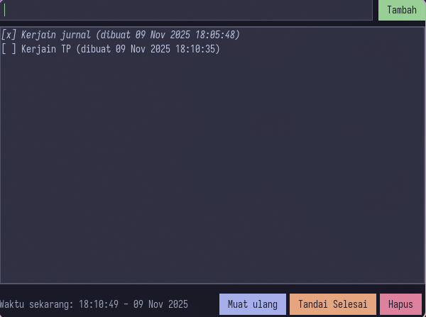

# Todo ThreadB

## Screenshot

## Strukturnya singkat

- **Database & JDBC**  
  Properti koneksi ada di `src/main/resources/db.properties`. `DatabaseInitializer` memastikan tabel `tasks` punya kolom `completed`. Semua komunikasi ke DB lewat `TaskDao` + `TaskService`, jadi UI tinggal manggil service tanpa mikir SQL.

- **Threading**  
  Swing wajib update UI di Event Dispatch Thread, jadi operasi DB dijalankan di executor background (`todo-worker`). Selain itu ada `clock-worker` terpisah yang tiap detik ng-update label jam berjalan — bentuk lain penggunaan thread yang keliatan langsung di UI. Semua hasil balik ke EDT pakai `SwingUtilities.invokeLater`, jadi UI tetap smooth dan jam tidak bikin UI nge-lag.

- **GUI**  
  `TodoAppFrame` menampilkan daftar tugas (pakai `JList` + custom renderer). Seluruh UI diwarnai dengan palet Catppuccin Mocha dan font default-nya dicoba pakai Iosevka (fallback ke monospace kalau font belum terpasang, jadi install Iosevka di OS kamu biar maksimal). Anti-alias diaktifkan otomatis supaya teks nggak kelihatan bergerigi. Ada field input + tombol Tambah, Muat ulang, Tandai Selesai, dan Hapus. Setiap tombol nge-trigger task background yang berhubungan dengan DB, dan state kontrol bakal otomatis ke-disable sementara biar user tau lagi ada proses.

